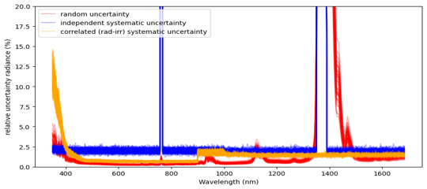

## 🎈 Background

The LANDHYPERNET and WATERHYPERNET networks (which together make up
the HYPERNETS network) consist of a set of autonomous hyperspectral
spectroradiometers (HYPSTAR®) acquiring fiducial reference measurements of
surface reflectance at various sites covering a wide range of surface types (both
land and water) for use in satellite Earth observation validation and remote
sensing applications.

The HYPERNETS_PROCESSOR is a Python software
package to process the HYPERNETS in-situ
hyperspectral raw data to reflectance and other variables.

## 🗸 Aims
In order to achieve fiducial reference measurement quality, uncertainties need to be
propagated through each step of the processing chain, taking into account
temporal and spectral error-covariance.

## 📋 Data
The HYPERNETS instruments measure downwelling hemispherical irradiance, and upwelling radiance. 
The raw data is provided as digital numbers, and combined with gains and non-linearity coefficients from Lab calibrations. 
The irradiance and radiance data are combined to calculate reflectance. 
These data are stored in different product files from L0-L2B.

## 🗸 Uncertainties
Three uncertainty contributions are tracked throughout the
processing.
• Random uncertainty: Uncertainty component arising from the
noise in the measurements, which does not have any error-correlation
between different wavelengths or different repeated
measurements (scans/series/sequences). 
• Systematic independent uncertainty: Uncertainty component
combining a range of different uncertainty contributions in the
calibration. Only the components for which the errors are not
correlated between radiance and irradiance are included.
• Systematic uncertainty correlated between radiance and
irradiance: Uncertainty component combining a range of
different uncertainty contributions in the calibration. Only
the components for which the errors are correlated between
radiance and irradiance are included. This error-correlation
means this component will become negligible when taking the
ratio of radiance and irradiance (i.e., in the L2A reflectance
products), which is why we separate it from the systematic
independent uncertainty. 

The two systematic uncertainty components are both based on lab calibrations.
Since the same lab calibration is used within the HYPERNETS_
PROCESSOR for repeated measurements (scans/series/
sequences), the errors in the systematic
uncertainty components are assumed to be fully systematic (errorcorrelation
made up of ones) with respect to different
scans/series/sequences. With respect to wavelength, we
combine the different error-correlations of the different
contributions and calculate a custom error-correlation
matrix between the different wavelengths.

## CoMet Setup
The HYPERNETS_PROCESSOR uses a Monte Carlo (MC)
approach, to propagate uncertainties and error-correlations
between product levels. This MC approach is implemented using [**punpy**](tools/punpy/).

The HYPERNETS products themselves are stored as digital effects tables using [**obsarray**](tools/obsarray/).

## Results
An example of the propagated uncertainties on the HYPERNETS radiances is shown below. 

These uncertainties can be propagated throughout further processing chains (see e.g. [this example](https://colab.research.google.com/github/comet-toolkit/comet_training/blob/main/hypernets_surface_reflectance.ipynb))

## Summary of Findings
The HYPERNETS_processor is operationally producing product files stored as digital effects tables. 
Uniquely for this type of processing, multiple different types of uncertainty
(including error-correlations) are propagated through each of the
processing levels.

These uncertainties have been very useful for the validation of satellite data (e.g. FLEX, CHIME, ENMAP, S2, ...).

## Future Work
There are a number of uncertainty components that are still missing from the HYPERNETS uncertainty budget (currently a placeholder uncertainty of 2% is added instead).
Dedicated studies will be performed to better quantify each of the missing components. 