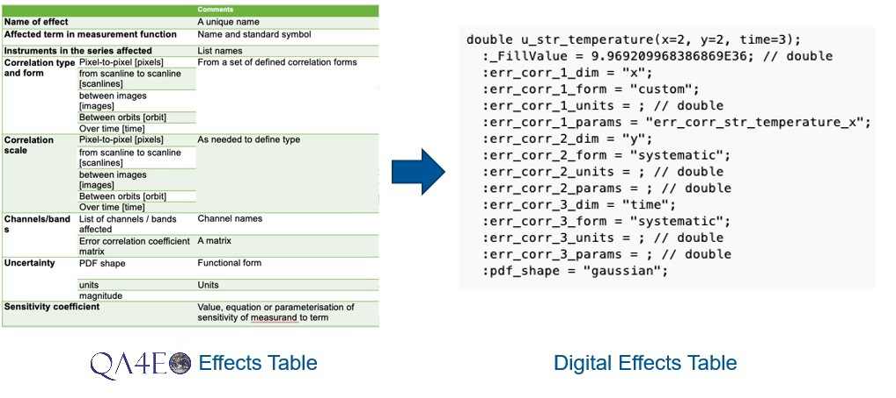

QA4EO is a best practice framework, based on the principles of metrology, to
establish The Global Earth Observation System of Systems — based on coordinated
and harmonised processes and activities that enable interoperability. QA4EO was
established and endorsed by the Committee on Earth Observation Satellites (CEOS).
QA4EO ensures credible and reliable interpretation of environmental observations from
satellites and in-situ measurements by requiring that associated uncertainty information
is provided. A [**set of guidelines**](https://qa4eo.org/documents/) was developed on how to apply the QA4EO principles
to generate metrologically-rigorous data products and to perform uncertainty analysis. 

There are five steps towards a metrological uncertainty analysis. These steps are described in detail in the [**QA4EO Process document**](https://qa4eo.org/docs/3_Process_Document.pdf) which provides Step-by-step guidance on implementing a metrological approach to uncertainty analysis. The 5 steps are:
•	Step 1: Define the measurand and measurement model
•	Step 2: Establish the traceability with a diagram (see example at the top of this page)
•	Step 3: Evaluate each source of uncertainty and fill out an effects table
•	Step 4: Calculate the data product and uncertainties
•	Step 5: Record information about the uncertainty analysis for long term data preservation purposes (implicit above) and summarise for today’s users

The CoMet toolkit is particularly useful for steps 4, (see our page on [**propagating uncertainties through a measurement function**](user-guide/theory/processing-chains/)) and step 5 (see our page on [error correlation and how to store it](user-guide/theory/error_correlation)).

As discussed in the QA4EO Process document, Effects Tables (step 3) are a useful way to record and report the information required to fully parameterise an error-correlation effect. However, to use this information in a processing chain, it must be provided digitally. The CoMet Toolkit defines a mechanism for this, with a metadata standard (see UNC specification) that enables the creation of Digital Effects Tables stored in NetCDF files. In this way, uncertainty information can be written, read, 

Punpy interfaces with obsarray to make uncertainty propagation as efficient and easy to use as possible. The digital effects tables produced with obsarray can be propagated through measurement functions using punpy, without the need for providing additional information. The data has thus been encoded with all relevant error-covariance information, though users do not need to interact with it. Together these tools enable both the experienced and inexperienced user to efficiently include uncertainties throughout their data processing, and thus make their datasets more reliable and interpretable. Optional keywords provide the user with the flexibility to deal with all kinds of complex use cases. 
For further info, we refer to the [**punpy**](https://punpy.readthedocs.io/en/latest/) and [**obsarray**](https://obsarray.readthedocs.io/en/latest/) documentation.

