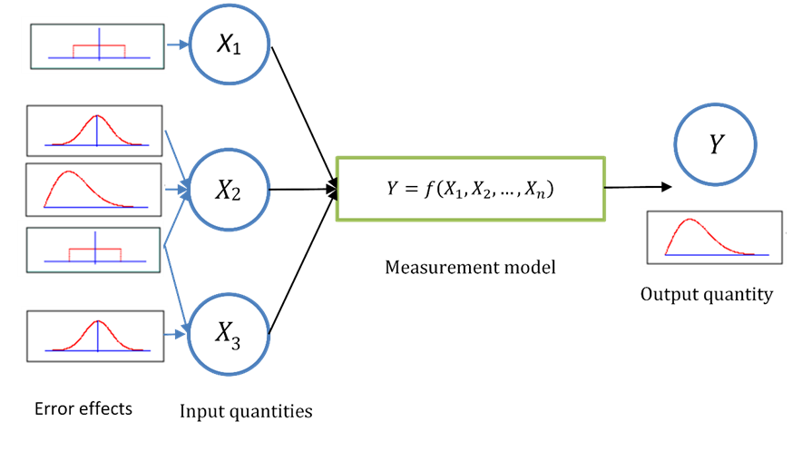

When determining the value of a given measurand (i.e. the quantity intended to be measured), some processing typically needs to be performed to calculate the measurand based on some input quantities. 
In some cases, this processing is relatively simple, and can be done with a simple analytical function.
In other cases, a full processing chain is needed, which can contain a whole range of computational processing steps.
In metrology (GUM), this relationship between the measurand and the input quantities is refered to as a measurement model or a measurement function. 
For some further information, we refer to this [FIDUCEO tutorial](https://research.reading.ac.uk/fiduceo/archive/tutorials/measurement-function-pt1/#:~:text=Often%2C%20we%20are%20able%20to%20explicitly%20write%20the,X%20i%2C%20via%20the%20functional%20relationship%20f%20f.).

In order to calculate the uncertainty on the measurand, one needs to propagate uncertainties on the input quantities through the measurement model.
There are various methods that can be used for this. Two commonly used ones are the Monte Carlo (MC) method and the Law of Propagation of Uncertainties. 
For further detail on these methods, see the [**GUM**](https://www.bipm.org/en/committees/jc/jcgm/publications) and its supplements, the [**QA4EO metrology document**](https://qa4eo.org/docs/2_Metrology_Document.pdf), or the [**punpy ATBD**](https://punpy.readthedocs.io/en/latest/content/atbd.html). 

CoMet toolkit implements both the Monte Carlo and the Law of Propagation of Uncertainty methodologies for uncertainty propagation. The CoMet toolkit interface to both of these methodlogies is exactly the same, so the user can easily switch between them and compare the results. There are two ways the input data and their uncertainties can be ingested in the CoMet toolkit. Either they can be ingested manually as numpy arrays, or they can be ingested using `Digital Effects Tables’, defined with obsarray. 

In order to propagate uncertainties using the CoMet toolkit, one needs to be able to write the measurement function as a Python function which takes the input quantities as arguments and returns the measurand. Inside this measurement function, there can be a varying range of complexity. It could be a simple analytical function, or a full processing chain, including calls to other external software. The CoMet toolkit treats this measurement function somewhat as a blackbox and simply modifies the inputs, and analyses the outputs. 
